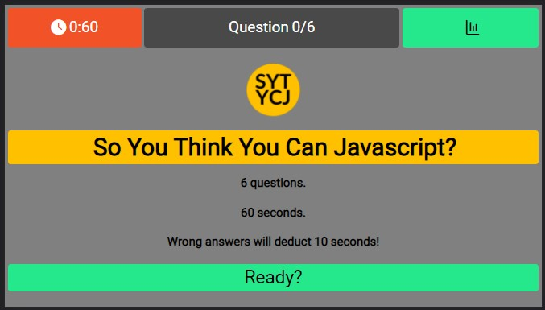
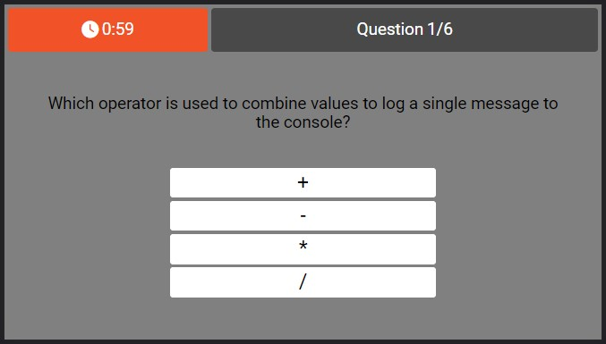
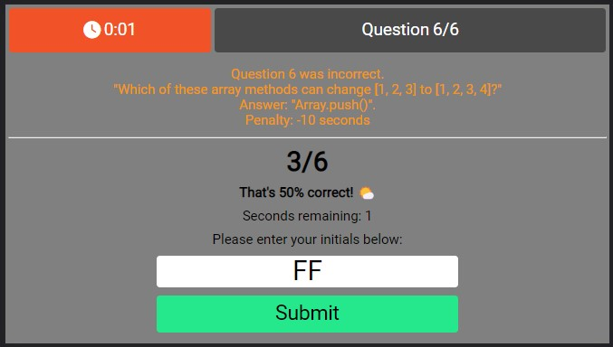
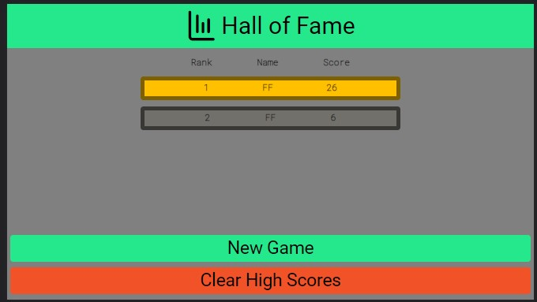

# Code Quiz

  

## Description

Students of Javascript often find it hard to remember fundamental concepts — this app's gamification is designed to help them grasp such concepts and remember them better after completing each game.

I made this app to illustrate the importance of dynamic DOM manipulation via Javascript.

While making this app, I learned about JSON parse and stringify.

## Usage

Deployed: [Code Quiz](https://leoelicos.github.io/bcs-04-code-quiz/). Will run on small and large screens.

## Screenshots

### Splash Page

### Questions

### Results

### High Scores

## Credits

-  BCS Resources

## License

&copy; Leo Wong <leoelicos@gmail.com>

Licensed under the [MIT License](./LICENSE).
